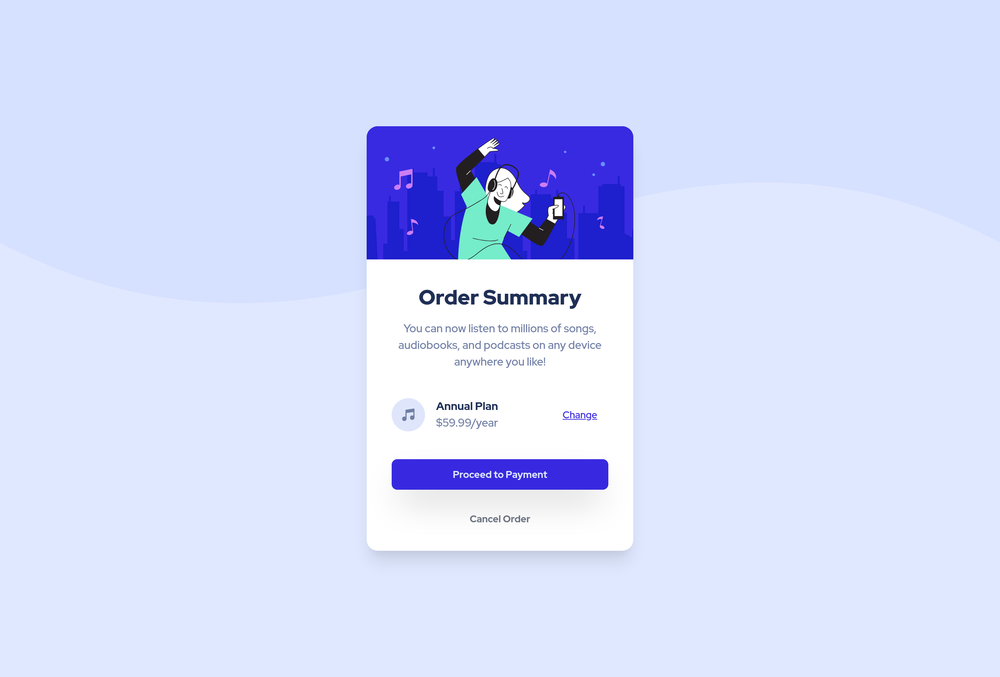

# Frontend Mentor - Order summary card solution

This is a solution to the [Order summary card challenge on Frontend Mentor](https://www.frontendmentor.io/challenges/order-summary-component-QlPmajDUj). Frontend Mentor challenges help you improve your coding skills by building realistic projects. 


## Overview

### The challenge

Users should be able to:

- See hover states for interactive elements


### Screenshot




### Links

- Solution URL: [GitHub's Repository](https://github.com/KennFatt/ui-challenge/tree/main/01-order-summary-component)
- Live Site URL: [Netlify](https://angry-pare-dfe056.netlify.app/)


## My process

### Built with

- Semantic HTML5 markup
- Mobile-first workflow
- [React](https://reactjs.org/) - JS library
- [TailwindCSS](https://tailwindcss.com/) - CSS Utilities based classes
- [Vite](https://vitejs.dev/) - Project build and deployment


### What I learned

1. The `<picture>` element

   Use various image source based on browser's criteria. I used this `<picture>` semantic to show the background decarator which has two different files. One for mobile and another one for desktop.

   ```jsx
   {/* Background SVG */}
   <picture className="absolute inset-0">
     {/* Desktop design */}
     <source
       media="(min-width: 1280px)"
       srcSet="/assets/pattern-background-desktop.svg"
     />
   
     {/* Default / fallback image (mobile-first) */}
     
   </picture>
   ```

   This line below (The `<source>` element) will be used when the browser has media query with `min-width: 1280px`. 

   ```jsx
   <source
     media="(min-width: 1280px)"
   	srcSet="/assets/pattern-background-desktop.svg"
   />
   ```


2. Disable image selection, especially the background decorator

   ```css
   .image-decorator {
     pointer-events: none;
     user-select: none;
   }
   ```

   By so doing, I want to prevent user to be able drag or select particular image such as background decorator.

   

   With TailwindCSS you could apply this utilitiy classes:

   ```jsx
   
   ```


### Useful resources

- [MDN's explaination and example for the usage of `<picture>` element](https://developer.mozilla.org/en-US/docs/Web/HTML/Element/picture) - The one source to help me implement `<picture>` element.


## Author

- Website - [GitHub - KennFatt](https://github.com/KennFatt)
- Frontend Mentor - [@kennfatt](https://www.frontendmentor.io/profile/kennfatt)
